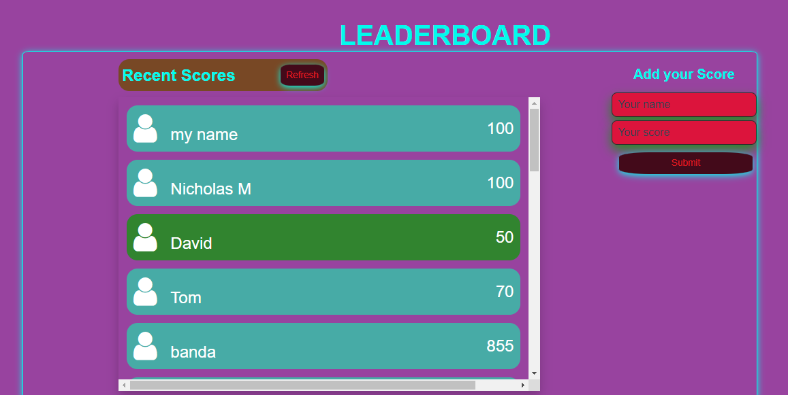

# LeaderBoard

## Description

The leaderboard website displays scores submitted by different players. It also allows you to submit your score. All data is preserved thanks to the external Leaderboard API service.

- This is the page view:

## Built With

- HTML
- CSS
- JavaScript

## Getting Started

To get a local copy up and running follow these simple example steps.

1. Clone the Repo or Download the Zip file or `https://github.com/Mutalenic/leaderBoard.git`.
2. `cd /leaderBoard`
3. Open it using live server by using this command: `npm run build` or `npm start`

## Test

For tracking linter errors locally you need to follow these steps:

After cloning the project you need to run these commands

`npm install` `This command will download all the dependancies of the project`

For tracking linter errors in HTML files run:

`npx hint .`

For tracking linter errors in CSS or SASS files run:

`npx stylelint "\*_/_.{css,scss}"`

And For tracking linter errors in JavaScript files run:

`npx eslint .`

## Live Demo

## Author

 👤 **Nicholas Mutale** https://github.com/Mutalenic
 
 - GitHub: [@GitHub/Mutalenic](https://github.com/Mutalenic)
 - LinkedIn: (https://www.linkedin.com/in/nicholas-mutale-715714124/)
 - Twitter: (https://twitter.com/nicomutale)

## Contributions, issues, and feature requests are welcome!

Feel free to check the [https://github.com/Mutalenic/leaderBoard/issues]

## Show your support

Give a ⭐️ if you like this project

## 📝 License

This project is [MIT](./MIT.md) licensed.
